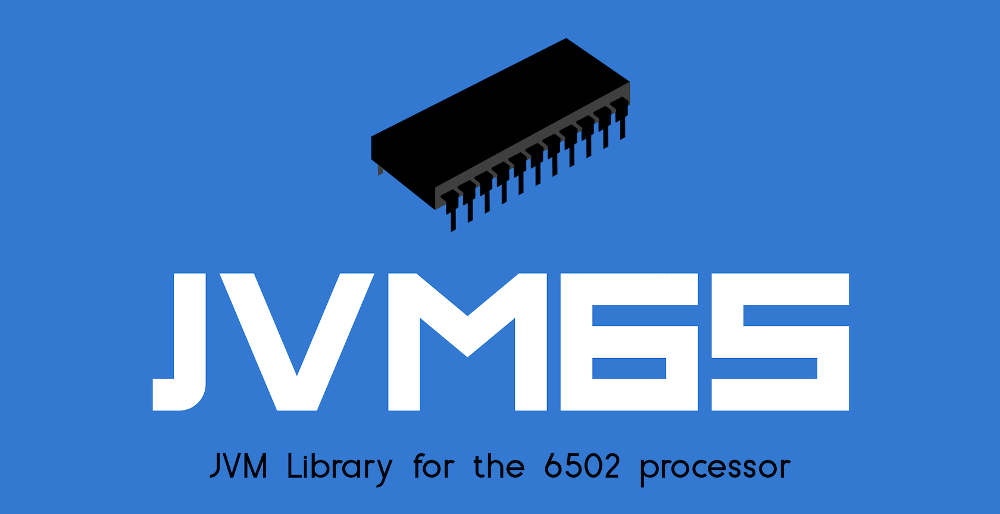
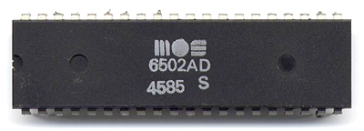

# jvm65
[](https://www.travis-ci.com/johnnystarr/jvm65)
[](https://sonarcloud.io/dashboard?id=johnnystarr_jvm65)
[](https://sonarcloud.io/dashboard?id=johnnystarr_jvm65)
[](https://sonarcloud.io/dashboard?id=johnnystarr_jvm65)
[](https://codecov.io/gh/johnnystarr/jvm65)

[](https://javadoc.io/doc/io.johnnystarr/jvm65)


A JVM library that provides a 6502 simulator.

### State of Project
This project is a WIP and is available as a pre-release for evaluation only_

### Implementation
jvm65 is written in Kotlin but is interoperable with any JVM language.

### Purpose
I have always loved the 6502 processor.  Although there are plenty of simulators out there, I wanted to target the JVM for the sake of curiosity and learning.

### Use Cases

- 6502 centric emulators
- Embedded systems simulation
- Academic studies

### Code Coverage


### Leverage in your project

#### Gradle Groovy

```groovy
implementation 'io.johnnystarr:jvm65:0.1.5'
```

#### Gradle Kotlin

```kotlin
implementation("io.johnnystarr:jvm65:0.1.5")
```

#### Apache Maven
```xml
<dependency>
  <groupId>io.johnnystarr</groupId>
  <artifactId>jvm65</artifactId>
  <version>0.1.5</version>
</dependency>
```

#### Maven Central
https://search.maven.org/artifact/io.johnnystarr/jvm65/0.1.5/jar

### The MOS 6502

